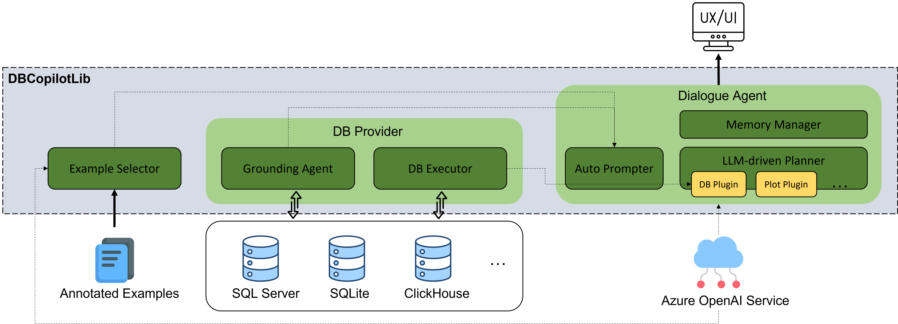

# DBCopilotLib-Samples

## Brief Introduction of DBCopilotLib
DBCopilot is a technology to support Chat experience on structured enterprise data. Developers can use DBCopilot library to easily build their own Chat agent that allows their users to ask any natural language questions against their enterprise data. 
DBCopilot also provides an extensible framework to help developers to extend the agent's capability by adding new APIs or Tools. Here, each Tool is an external execution engine to run a specific kind of program. For example, SQL executor for Azure SQL Server is a Tool for the execution of SQL programs, and Python runtime environment is another Tool for the execution of Python programs. 


## Install DBCopilotLib

You can start with a fresh conda environment for `python (>= 3.8, <=3.10)` and you need `artifacts-kerying` for authentication:

```bash
conda create -n dbcopilot_env python=3.9 -y
conda activate dbcopilot_env
# Before install artifacts-keyring, please ensure that you have .NET SDK >= 5.0 installed
python -m pip install artifacts-keyring
python -m pip install --upgrade dbcopilot[extensions] --index-url=https://pkgs.dev.azure.com/TScience/_packaging/AIMS.TScience.NL2Code/pypi/simple/
```

If the authentication does not work,
a workaround is to create a PAT token following
[this doc](https://learn.microsoft.com/en-us/azure/devops/organizations/accounts/use-personal-access-tokens-to-authenticate?view=azure-devops&tabs=Windows#create-a-pat),
then:

```bash
# Replace "{PAT_TOKEN}" with the PAT token you have just created
python -m pip install --upgrade dbcopilot[extensions] --index-url=https://{PAT_TOKEN}@pkgs.dev.azure.com/TScience/_packaging/AIMS.TScience.NL2Code/pypi/simple/
```

Moreover, you should also install the ODBC Driver for SQL Server
[[windows]](https://learn.microsoft.com/en-us/sql/connect/odbc/download-odbc-driver-for-sql-server?view=sql-server-ver16#download-for-windows)
[[linux]](https://learn.microsoft.com/en-us/sql/connect/odbc/linux-mac/installing-the-microsoft-odbc-driver-for-sql-server?view=sql-server-ver16&tabs=alpine18-install%2Calpine17-install%2Cdebian8-install%2Credhat7-13-install%2Crhel7-offline#18).

## Usage Examples

- [Sample Application for Azure SQL Server Databases](./samples/sqlserver/README.md)
- [Self-Serve End-to-End DBCopilot Endpoint On Your Own AzureML Workspace](./docs/create-dbcopilot-endpoint.md)
- [Sample Code for Customizing Your Own Example Selector for Automated Prompt Engineering](./samples/example_selector/README.md)
- Chat UI (coming soon!)
- Promptflow for you to test your data and end point(coming soon)

## How It Works

[Read the doc](./docs/how-dbcopilot-works.md).



