# Self-Serve DBCopilot as AzureML Endpoint


1. Join "DBCopilotRegistry" security group in [idweb](https://aka.ms/idweb).

2. [Create an AzureML workspace](https://learn.microsoft.com/en-us/training/modules/create-workspace-resources-getting-started-azure-machine-learning/5-create-azure-machine-learning-workspace) Your-Workspace-Name, in Resource Group Your-Resource-Group-Name.  
	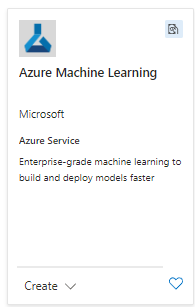

3. Create connections in your workspace.
	1. Add flight (&flight=promptflow) to workspace URL.
	2. Click "Create a new connection" in the "Connections" tab.
	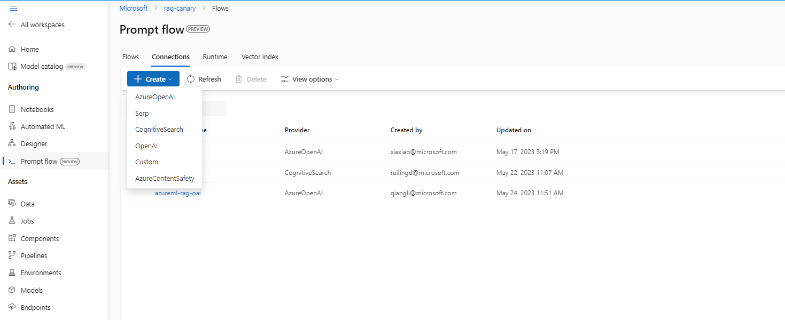
	3. Create an azure open ai connection in your workspace.
    4. (Optional) Create a cognitive search connection in your workspace. (Only if you want to use ACS for embedding vector search instead of FAISS)

4. In AzureML workspace studio, create data asset with name "Your-Sample-DataSet-Name". Upload DBCopilot Sample files from local. You can find the sample files in
	[samples.zip](./files/samples.zip)  
	Operation Steps:

	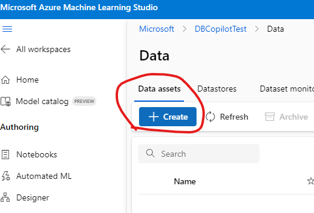
	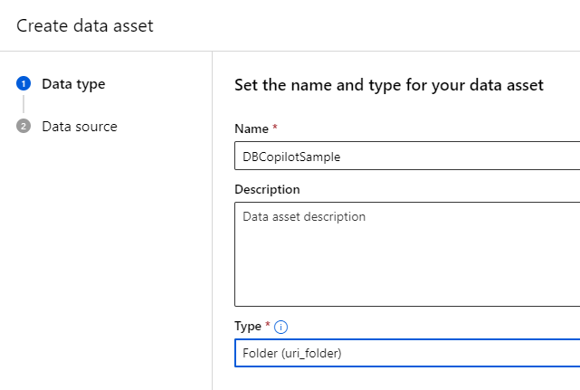
	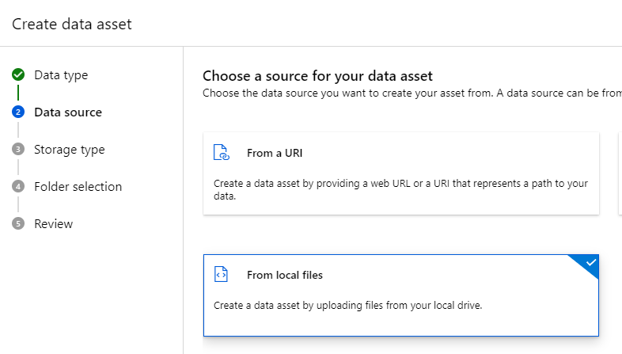
	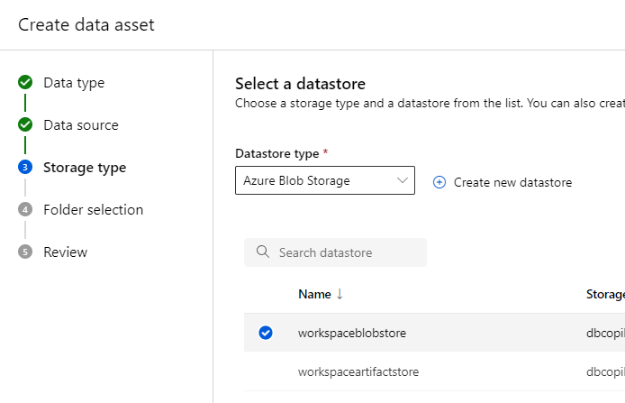
	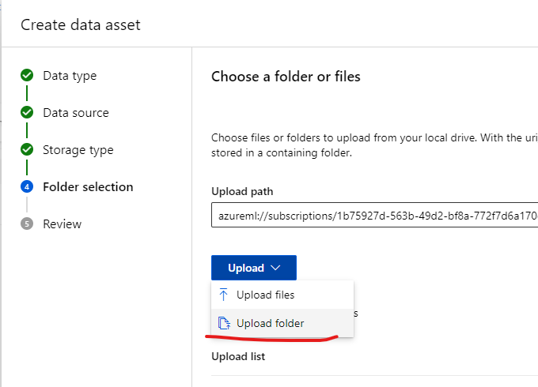
	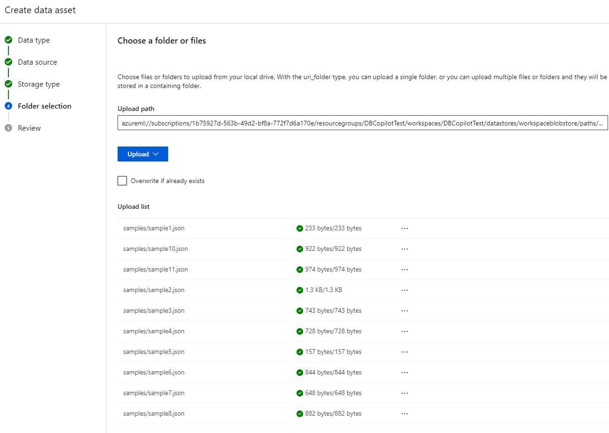

5. [Allow Azure services and resources to access the SQL server](https://learn.microsoft.com/en-us/azure/azure-sql/database/network-access-controls-overview?view=azuresql#allow-azure-services):  
	Add a datastore linked to your sql database.

	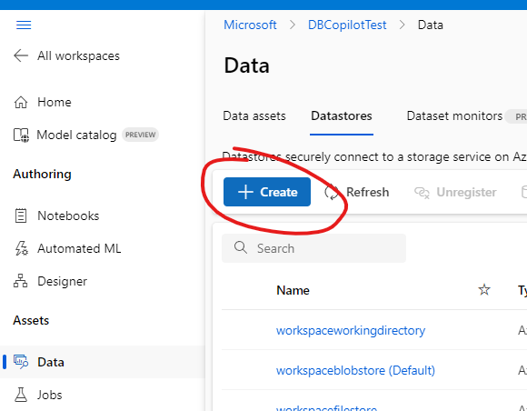
	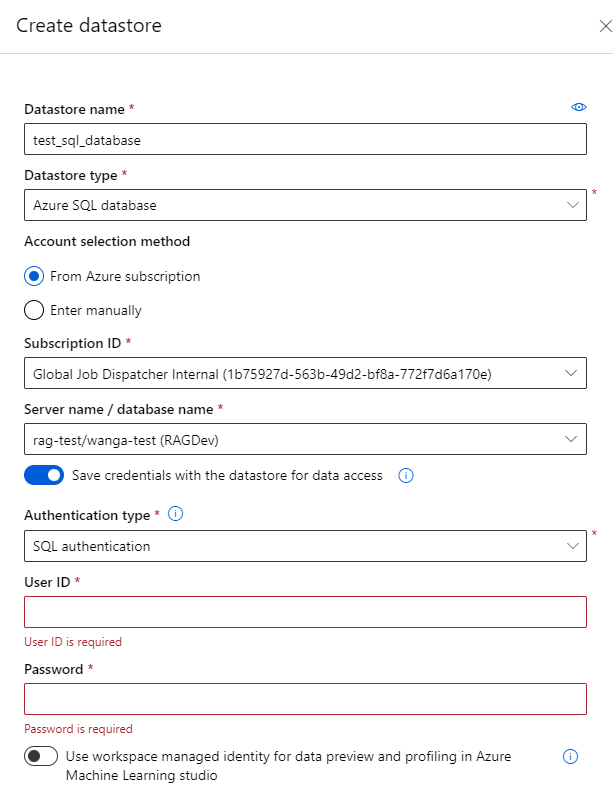

6. Create a compute cluster  
	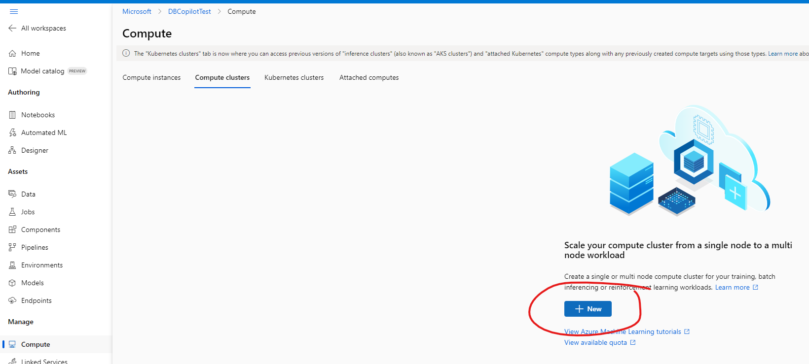
	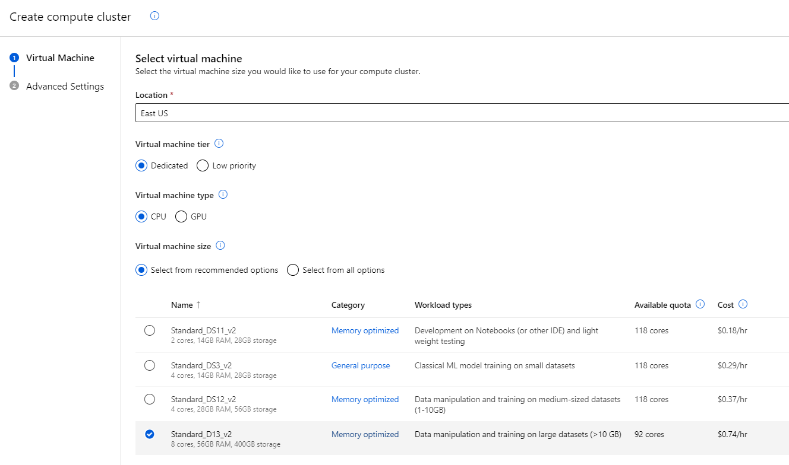
	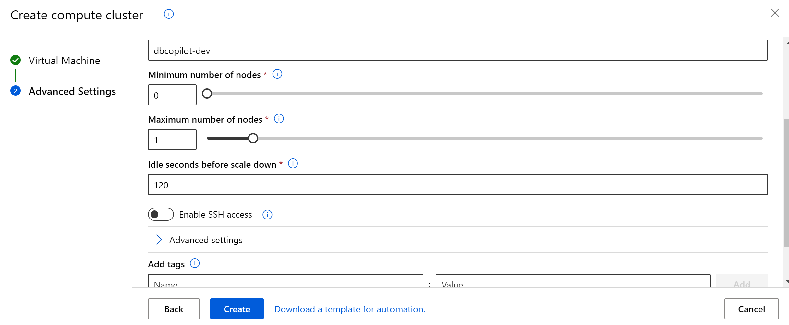

7. Create a azureml online endpoint with yaml. This command will return the azureml online endpoint's "name" and "identity.principal_id", save them for furthur ussage.  
	prerequisite: [az cli](https://learn.microsoft.com/en-us/cli/azure/install-azure-cli)  
	Check your az verion by: 
	az version  
	Your az-cli should have the following extensions. versions should be the same or higher.  
	```
	{
	  "azure-cli": "2.46.0",
	  "azure-cli-core": "2.46.0",
	  "extensions": {
	    "ml": "2.14.1"
	  }
	}
	```
	If your az-cli's version is too low, please run: az upgrade.  
	If you az-cli do not have ml extension, please run: az extension add -n ml -y  
	If your az-cli's ml extension's version is too low, please run: az extension update -n ml  

	You need to login with [az login](https://learn.microsoft.com/en-us/cli/azure/authenticate-azure-cli) before run az command.  
	Az Command:  
	```
	az ml online-endpoint create --file endpoint.yaml --resource-group my-resource-group --workspace-name my-workspace
	```
	Yaml:  

	[endpoint.yaml](./files/endpoint.yaml)

	If get 'online-endpoint' is misspelled or not recognized by the system, the solution is:
	```
	az extension remove -n azure-cli-ml
	az extension remove -n ml
	az extension add -n ml -y
	```


8. Add auzreml online endpoint's identity with azureml workspace's "AzureML Data Scientist" role. Use the azureml online endpoint's name to search for the identity.  
	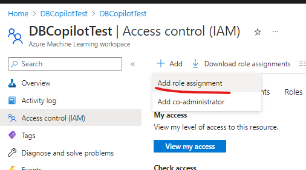
	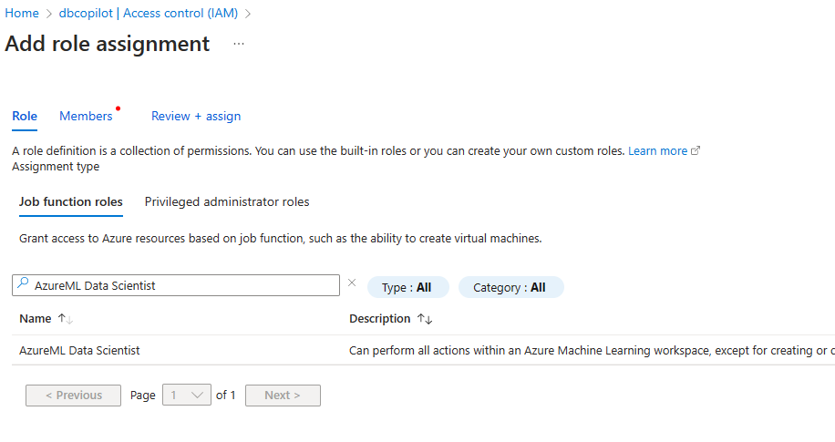
	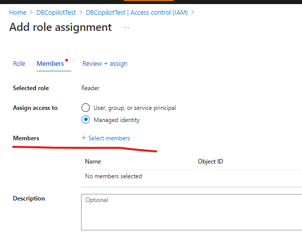
	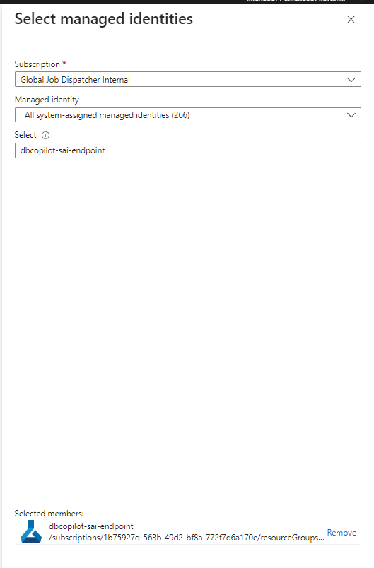
	

9. Prepare Pipeline Creation Yaml
    [dbcopilot_e2e_pipeline.yaml](./files/dbcopilot_e2e_pipeline.yaml) for FAISS index or
    [dbcopilot_acs_e2e_pipeline.yaml](./files/dbcopilot_acs_e2e_pipeline.yaml) for ACS index

	
	update inputs in Yaml:  
	
	```
	inputs:
	  sample_data:
	    type: uri_folder
	    path: "your-sample-data-azureml-path"
	  endpoint_name: "dbcopilot-sai-endpoint"
	  deployment_name: "e2e"
	  embeddings_model: "azure_open_ai://endpoint/{your_aoai_endpoint_name}/deployment/{your_embedding_model_deployment_name}/model/text-embedding-ada-002"
	  sql_datastore: "your-sql-datastore-name"
	  chat_aoai_deployment_name: "your-gpt-35-turbo-deployment-name"
	  embedding_aoai_deployment_name: "your-text-embedding-ada-002-deployment-name"
	  mir_environment: "azureml://registries/Project-DBCopilot-Canary/environments/db_copilot_mir"
	  compute: "azureml:{your-azureml-compute-cluster-name}"
	```
	endpoint_name and deployment_name: the name of MIR endpoint and deployment you will create with this pipeline.  
	embeddings_model, the openai embedding model you will use. *azure_open_ai://endpoint/{your_aoai_endpoint_name}/deployment/{your_embedding_model_deployment_name}/model/text-embedding-ada-002*  
	sql_datastore: the name of the datastore which linked with your sql databse.  
	Compute: *azureml:{compute_cluster_name}*  
	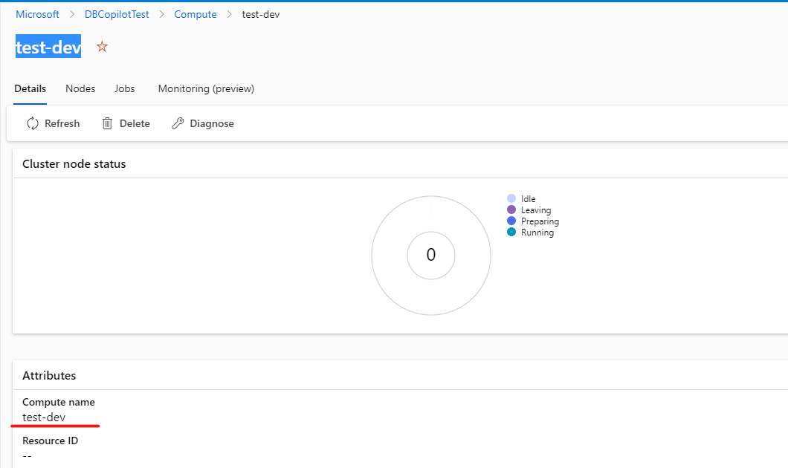
	
	sample_data: the Datastore URI of the DBCopliotSample you created  
	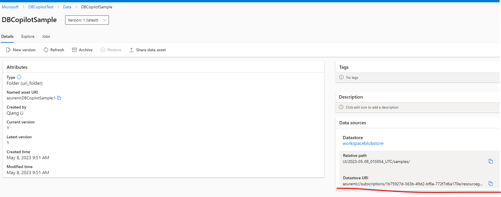

10. Run dbcopilot endpoint pipeline:  
	```
	az ml job create --file .\docs\files\dbcopilot_e2e_pipeline.yaml --subscription Your-Subscription-Id --resource-group Your-Resource-Group-Name --workspace Your-Workspace-Name
	```
	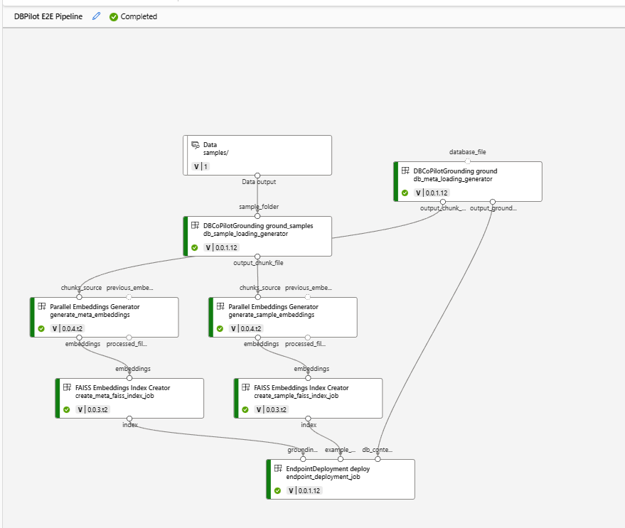
11. Test dbcopilot Endpoint  
	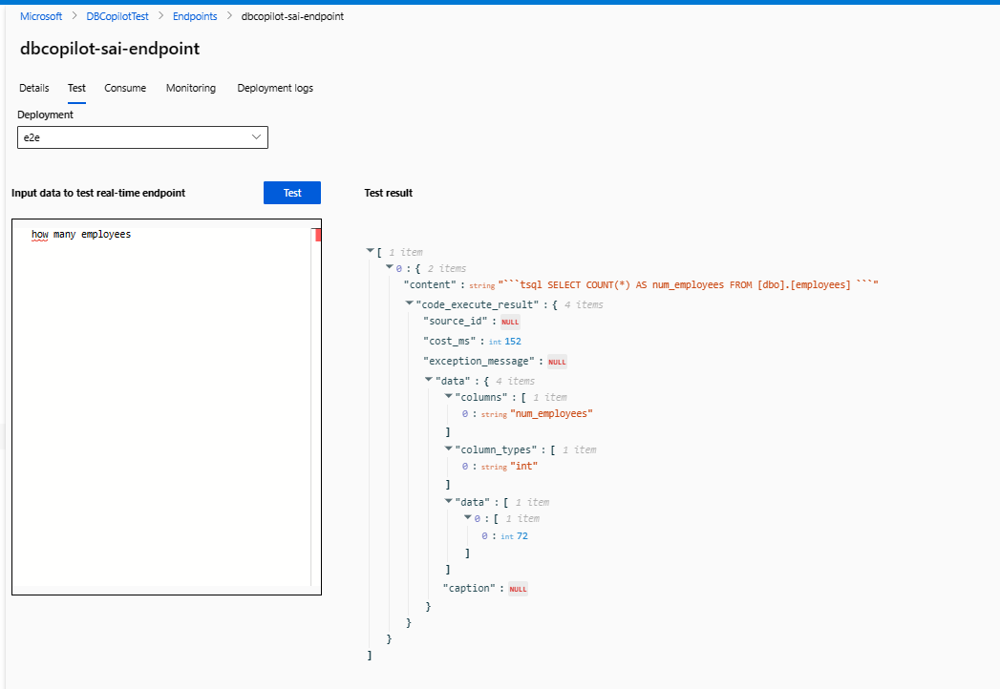

12. Consume endpoint with code:  
	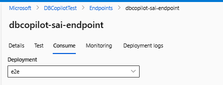