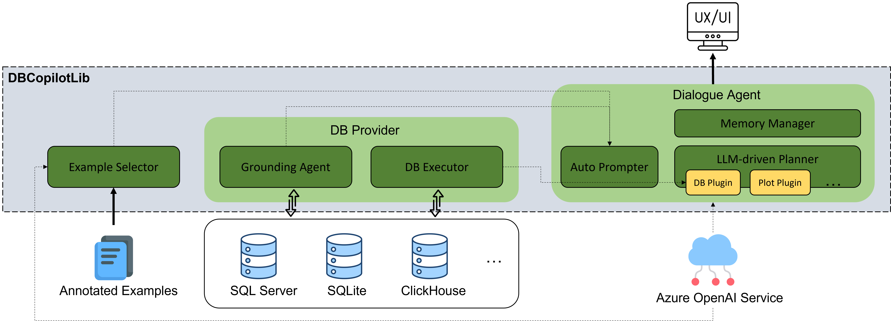
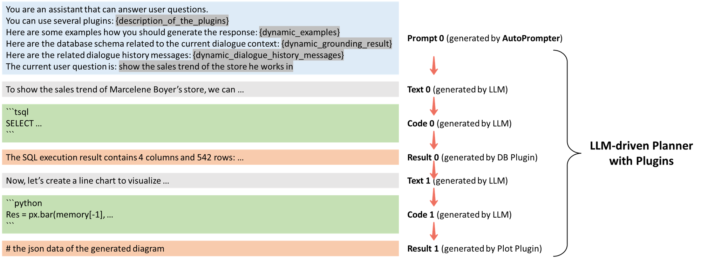

# How DBCopilot Works

## Features

- **Grounding**:
  Even if there are a large number of tables/columns/rows in the databases,
  the grounding agent can dynamically select appropriate schema information into the prompt according to the current dialogue context.
  This not only avoids exceeding the prompt length limit, but also improves the generation quality.
- **DB Executor**:
  It is unsafe and non-compliant to execute SQL queries generated by AI directly against the databases.
  Therefore, we allow customers to define custom constraints/checks on the DB Executor module.
- **Python Executor**:
  Currently, it is unsafe and non-compliant module to execute Python code generated by AI directly.
  With this, we allow customers to define custom APIs (also called Plugins or Tools) to extend the capabilities of the system. 
  For example, it is possible to integrate with other systems (e.g., doc searcher, data mining tools) by defining custom APIs or using external Python libraries.
- **Example Selector**:
  We allow customers providing annotated examples (i.e., question/response pairs) to better coach the LLM.
  Technically, these examples will be dynamically selected (according to the current dialogue context) then added to the prompt.
- **Memory Manager**:
  The dialogue history is well managed in the memory, thus enabling multi-turn chat experience.
  For example, the user asks *"who sold the most"* then asks *"show the sales trend of the store he works in"*.
- **LLM-driven Planner with Plugins**:
  The scope of DBCopilot is not limited to NL-to-SQL:
  it can generate natural language responses based on the SQL execution results;
  it can plot diagrams based on the SQL execution results;
  it can also run Python code to do advanced data analytics or call any external services.
  Currently, we are working on integrating it with doc searcher ([tprompt](https://aka.ms/tprompt)) and advanced data analytics tools (e.g., insight analysis and correlation/causality analysis).
  They can be implemented as plugins then easily integrated by the LLM-driven planner.
  
## How the Planner Works

This figure illustrates how the planner integrates the LLM and different plugins (or APIs) to generate responses:

### The Planner Flow in this Example

1. The autoprompter generates `prompt_0` by leveraging the grounding agent, the example selector, and the memory manager.
2. `text_0 = LLM(prompt=prompt_0)`.
3. `code_0 = LLM(prompt=concat(prompt_0, text_0))`.
4. `result_0 = db_plugin.execute(code_0).summary()`.
5. `text_1 = LLM(prompt=concat(prompt_0, text_0, code_0, result_0))`.
6. `code_1 = LLM(prompt=concat(prompt_0, text_0, code_0, result_0, text_1))`.
7. `result_1 = plot_plugin.execute(code_1).summary()`.
8. stop (`LLM(prompt=concat(prompt_0, ..., result_1)) == stop_symbol`).

Here, the steps can be roughly categorized as the following types: 1. Thought; 2. Actions; 3. Observations; 4. Ask (optional). 5. Reflection (optional). Among these, step 2/3/4 can be iterated several times. 
Sometime, a user task description may be ambiguous or under-specified. Ask is a kind of specific response generated by LLM to ask the user to clarify.  In the process, Actions can be a SQL program that can manipulate the data from the database or a Python program with custom APIs. 

The key idea of DBCopilot framework is that it can trigger the execution of Actions on-the-fly whenever an action program is generated and append the execution results to the prompt.

### Why Is the Planner Designed Like This?

The planner is inspired by the ideas from two papers:
- **ReAct**: [ReAct: Synergizing Reasoning and Acting in Language Models](https://arxiv.org/abs/2210.03629)
- **ToolFormer**: [Toolformer: Language Models Can Teach Themselves to Use Tools](https://arxiv.org/abs/2302.04761)

The key difference is: **dynamically executing the plugins during LLM generation**, which is different from another paradigm that *generate-all-then-execute-all*.
We choose such an interruption mechanism rather than explicitly a predefined control/orchestration flow because the interruption-based mechanism is easy-to-maintain, much more robust, and flexible. It is also arguably very close to the way a human accomplishes a task.

## How the Grounding Agent Works

Given a user question and a database consisting a large number of tables/columns/rows,
the grounding agent will extract a small number of salient tables/columns/values that related to the question.
Then, the extracted information will be added to the prompt, guiding the language models generating reliable SQL queries.

### Offline Indexing

Given a database, we build an index for its content (i.e., tables, columns, and textual values),
thus the grounding agent can find items that related to the user question efficiently.

Each index item consists of two parts:

- **Embedding**
  - Embeddings are float vectors produced by deep learning encoders.
  - The cosine similarity between two embeddings reflects the semantic similarity between two items.
  - DBCopilotLib supports different embedding models,in which the most popular one is `text-embedding-ada-002` provided by OpenAI.
  - For tables and columns, the grounding agent produces their embeddings based on their names.
    Customers are allowed to provide more textual description for these items, thus optimizing the embeddings.
- **Metadata**
  - For example, item type (table/column/value), column type (numeric/textual/datetime/...) and item relationships (contains/foreign_keys/...).

### Online Inference

After the index is built, the grounding agent can generate the grounding result for each user question efficiently,
and the grounding result can be leveraged to build the prompt string for LLMs.
This online inference process consists of two steps:

- **Retrieve candidate items based on the embedding index**
  - The grounding agent calculates the embedding of the user question,
    then use this embedding to retrieve the top-K items from the index
    (based on embedding cosine similarity).
  - The time complexity of this step is `O(m + log(n))`,
    where `O(m)` represents the time complexity for calculating the embedding of the user question,
    and `n` represents the total number of items in the index.

- **Generate the grounding result based on stuctural features**
  - Re-rank the candidate items based on their data types and relationships.
  - Add additional salient items.
    For example, if two tables are ranked high in the retrieval result,
    we should also add the columns that can join them together to the grounding result.

### Evaluation

We evaluate the quality of our grounding agent based on the [spider dataset](https://yale-lily.github.io/spider).

Metric: `Recall(i, j, k)`: for each test case, if we keeps at most i tables, j columns and k values in the grounding result,
does it contain ALL tables/columns/values in the ground truth SQL?

Performance:
- Recall(3, 10, 10) = 94.1%
- Recall(5, 10, 10) = 97.7%

## How the Example Selector Works?

Please refer to [this doc](../samples/example_selector/README.md).