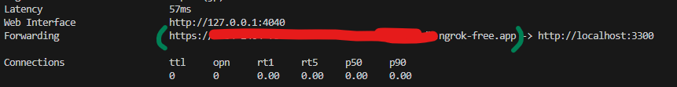

# Creating Your Own DB Provider Endpoint for Online Playground

The goal of this page is to help you quickly try DBCopilot on your own **sample databases**.
Please ensure that **you should use non-commercial databases without any secret data** (we do not make any guarantees about the security and compliance of the sample databases).
For product uses, please use our [AzureML pipeline](/docs/create-dbcopilot-endpoint.md) to ensure security and compliance.

## Prerequisites

### Install DBCopilotLib

Follow [the instructions](https://dev.azure.com/TScience/NL2Code/_git/DBCopilotLib-Samples?anchor=install-dbcopilotlib) to install DBCopilotLib.

### Database Configuration

1. Copy and paste `configs/db_flask_config.json.template` as `configs/db_flask_config.json`.

2. In this config file, we provide a sample Azure SQL Server database (The SQL authentication in `conn_string` is readonly):
    ```javascript
    [
        {
            "db_id": "BikeStores",
            "conn_string": "sqlserver://SERVER=db-samples-for-tprompt.database.windows.net;UID=ReadOnlyUser;PWD=p@ssw0rd!23;DATABASE=BikeStores;PORT=1433;"
        }
    ]
    ```

## Create the DB Provider Endpoint

### Create the Endpoint on Your Local Machine

```python
python db_flask.py
```

### Create A Tunneling URL Using ngrok

**Please skip this step if your local machine has a publicly accessible IP address.**

1. Install [ngrok](https://ngrok.com/download)

2. Add authtoken

    ```
    ngrok config add-authtoken <token>
    ```

3. Start a tunnel

    ```
    ngrok http 3300
    ```

4. When ngrok starts, copy and save the public forwarding URL for later

    

### Connect the Endpoint to DBCopilot Online Playground

1. In [aka.ms/dbcopilot](https://aka.ms/dbcopilot), click `CONNECT TO YOUR OWN DB`, then `Connect to Your Own DB Provider`

2. Enter `{endpoint_url}/score;{db_id}` in the input box, then click `Connect`

    - If you use ngrok, the `{endpoint_url}` is the public forwarding URL, e.g., `https://xxxxx.ngrok-free.app`;

    - If you do not use ngrok, the `{endpoint_url}` is `http://{your_local_machine_ip_for_public_network_access}:3300`.