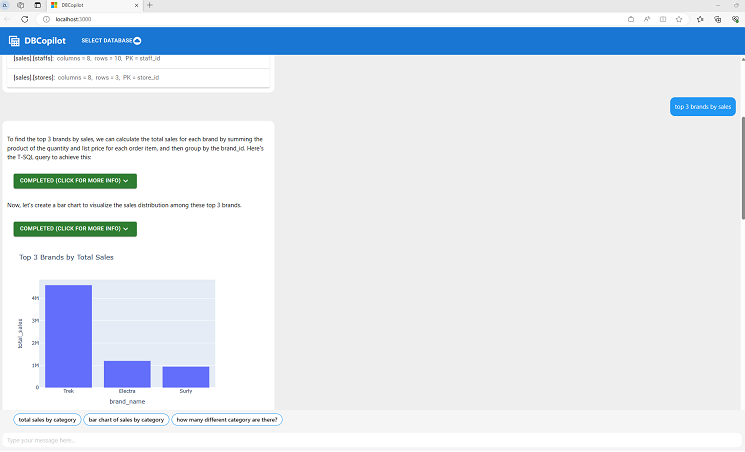

# DBCopilot Sample Application for Azure SQL Server Databases

This sample allows you to build and self-serve your own dbcopilot chatbot on your own databases and resources.



## 1. Prerequisites

Before you get started, make sure you have the following requirements in place:

- **Python Environment**

    - You can start with a fresh conda (e.g., [Miniconda](https://docs.conda.io/en/latest/miniconda.html)) environment for `python (>= 3.8, <=3.10)`, and you need `artifacts-keyring` for authentication:

        ```bash
        conda create -n dbcopilot_env python=3.9 -y
        conda activate dbcopilot_env
        # Before install artifacts-keyring, please ensure that you have .NET SDK >= 5.0 installed
        python -m pip install artifacts-keyring
        python -m pip install --upgrade dbcopilot[extensions] --index-url=https://pkgs.dev.azure.com/TScience/_packaging/AIMS.TScience.NL2Code/pypi/simple/
        ```

    - If the authentication does not work, a workaround is to create a PAT token following
      [this doc](https://learn.microsoft.com/en-us/azure/devops/organizations/accounts/use-personal-access-tokens-to-authenticate?view=azure-devops&tabs=Windows#create-a-pat),
      then:

        ```bash
        # Replace "{PAT_TOKEN}" with the PAT token you have just created
        python -m pip install --upgrade dbcopilot[extensions] --index-url=https://{PAT_TOKEN}@pkgs.dev.azure.com/TScience/_packaging/AIMS.TScience.NL2Code/pypi/simple/
        ```

- **ODBC Driver for SQL Server**
(
[[windows]](https://learn.microsoft.com/en-us/sql/connect/odbc/download-odbc-driver-for-sql-server?view=sql-server-ver16#download-for-windows)
,
[[linux]](https://learn.microsoft.com/en-us/sql/connect/odbc/linux-mac/installing-the-microsoft-odbc-driver-for-sql-server?view=sql-server-ver16&tabs=alpine18-install%2Calpine17-install%2Cdebian8-install%2Credhat7-13-install%2Crhel7-offline#18)
)

- **Node.js Environment** ([https://nodejs.org/en](https://nodejs.org/en))

- **Azure OpenAI Resource** ([https://oai.azure.com/portal](https://oai.azure.com/portal))

    - Create two deployments: one for model `text-embedding-ada-002`, and the other for model `gpt3-35-turbo`.

## 2. Configuration

- **Configure the Database Connection**

    1. Copy and paste `configs/db_flask_config.json.template` as `configs/db_flask_config.json`.

    2. In this config file, we provide a sample Azure SQL Server database (The SQL authentication in `conn_string` is readonly):

        ```javascript
        [
            {
                "db_id": "BikeStores",
                "conn_string": "sqlserver://SERVER=db-samples-for-tprompt.database.windows.net;UID=ReadOnlyUser;PWD=p@ssw0rd!23;DATABASE=BikeStores;PORT=1433;",
                "sampleQueries": ["top 3 brands by sales"]
            }
        ]
        ```

- **Azure OpenAI Configuration**

    1. Copy and paste `configs/secrets.json.template` as `configs/secrets_config.json`.

    2. Replace the placeholders in this config file as the corresponding values in your own Azure OpenAI Service resource.

        - Note that, the embedding deployment should be based on the `text-embedding-ada-002` model.

## 3. Start the Backend DB Provider Service

```bash
python db_flask.py
```

This command runs a flask service on `http://127.0.0.1:3300`.

This step succeeds when you see the following logs in the console:

```bash
 * Serving Flask app 'db_flask'
 * Debug mode: off
```

## 4. Start the Backend Chat Service

```bash
python app.py
```

This step succeeds when you see the following logs in the console:

```
INFO:engineio.server:Server initialized for gevent.
```

## 5. Start the FrontEnd WebApp

1. Enter the client folder

    ```bash
    cd client
    ```

2. Install and run vsts-npm-auth to get an Azure Artifacts token added to your user-level .npmrc file

   ```bash
   npm install -g vsts-npm-auth --registry https://registry.npmjs.com --always-auth false
   vsts-npm-auth -config .npmrc
   ```

   Note: You don't need to do this every time. npm will give you a 401 Unauthorized error when you need to run it again.

3. Install node.js dependencies

    ```bash
    npm install
    ```

4. Start the web app

    ```bash
    npm start
    ```

    With the back end and front end running, your web browser should automatically launch and navigate to `http://localhost:3000`.

5. Have fun!

    Note: Each chat interaction will call Azure OpenAI which will use tokens that you may be billed for.
    
## Customize DBCopilot DialogueAgent

### Use GPT-4 to Improve the Response Quality

In `events.py`, create `gpt4_llm: OpenaiChatLLM` with your GPT-4 deployment (`gpt4_llm = OpenaiChatLLM(..., model={gpt4_deployment}`) and use it in the `DefaultPlanner`: `DefaultPlanner(..., llm=gpt4_llm)`.

### Customize the Example Bank

You can customize `examples.py` to continually improve the response quality.

### Other Database Systems

DBCopilot supports different database systems other than SQL server.
You can customize in `configs/db_flask_config.json`.

For example:

#### SQLite

```javascript
[
    {
        "db_id": "sqlite_example_db",
        "conn_string": "sqlite://D:/example.sqlite"
    }
]
```

Note that, you also need to convert the `tsql` code blocks in `examples.py` into `sqlite` code blocks.

#### CSV Files

```javascript
[
    {
        "db_id": "csv_example_db",
        "conn_string": "sheet_file://{\"cities\": \"C:/Users/zelin/Downloads/cities.csv\", \"biostats\": \"C:/Users/zelin/Downloads/biostats.csv\"}"
    }
]
```

Note that, you also need to convert the `tsql` code blocks in `examples.py` into `sqlite` code blocks.

#### Kusto Database

```javascript
[
    {
        "db_id": "kusto_example_db",
        "conn_string": "kusto://https://kusto_cluster_name.eastus.kusto.windows.net",
        "database": "db_name"
    }
]
```

Note that:

- You need to set kusto role-based access control following [this tutorial](https://learn.microsoft.com/en-us/azure/data-explorer/kusto/access-control/role-based-access-control).

- You also need to convert the `tsql` code blocks in `examples.py` into `kql` code blocks.

## Deploy to Azure Web App

1. Create an Azure Web App (linux, Stack: Python 3.10). Assume that the web app base name is `dbcopilot-demos`, the slot name is `dev2`, and the web app full name is `dbcopilot-demos-dev2`.

2. App Configuration ==> General Setting ==> Startup Command
    
    ```
    apt-get update && apt-get install -y gcc && pip install cdifflib==1.2.6 && gunicorn --bind=0.0.0.0 --timeout 600 -k geventwebsocket.gunicorn.workers.GeventWebSocketWorker app:app
    ```

3. App Configuration ==> Application Setting ==> Add the following environment variables:

    - `SCM_DO_BUILD_DURING_DEPLOYMENT = 1`
    - `DB_CONFIG_JSON`: content of `configs/db_flask_config.json`
    - `SECRETS`: content of `configs/secrets.json`

4. In your own branch, create file `client/config/config.{webapp_full_name}.json` with content:

    ```javascript
    {
        "endpoint": "https://{webapp_full_name}.azurewebsites.net/"
    }
    ```

5. In your own branch, update `/azure-pipelines/pack.yml`

    - Replace `dbcopilot-demos-dev` with your `{webapp_full_name}`.

6. Trigger [this pipeline](https://dev.azure.com/TScience/NL2Code/_build?definitionId=159) on your own branch.

7. In your pipeline run, download the final published artifact (zip file) to your local machine.

8. Deployment

    - (One-time action) `az logout` then `az login`

    - Run this script

        ```bash
        az webapp deployment source config-zip --name {webapp_base_name} -g {resource_group} --subscription {subscription_name} --src {downloaded_file_name} --slot {webapp_slot_name}

## Sample Web App for DBCopilot AzureML Endpoint

If you have already deployed a DBCopilot AzureML endpoint according to [this doc](https://tprompt-docs.azurewebsites.net/structured_data/0203_aml.html), you can follow the following instructions to create the front-end web app for the AzureML endpoint.

1. Install the dbcopilot python library in your python environment as introduced above.

2. Start the backend chat service with the AzureML endpoint parameters:

    ```bash
    python app.py --aml_endpoint_url https://xxxx.xxxx.inference.ml.azure.com/score --aml_endpoint_key xxxxxxxxxxxxxxxxxx --aml_endpoint_deployment_name xxxxx
    ```

3. Start the frontend webapp as introduced above.

4. If you want to deploy it to Azure Web App, besides the instructions introduced above, you also need to set web app environment variables: `aml_endpoint_url`, `aml_endpoint_key`, and `aml_endpoint_deployment_name`.